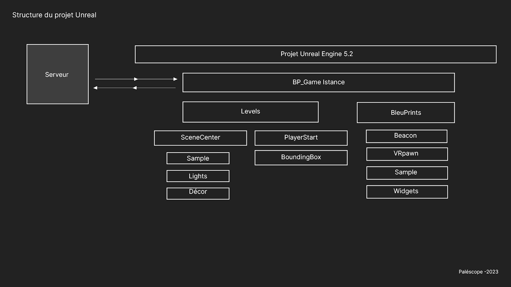
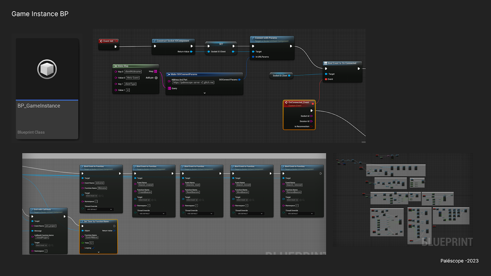
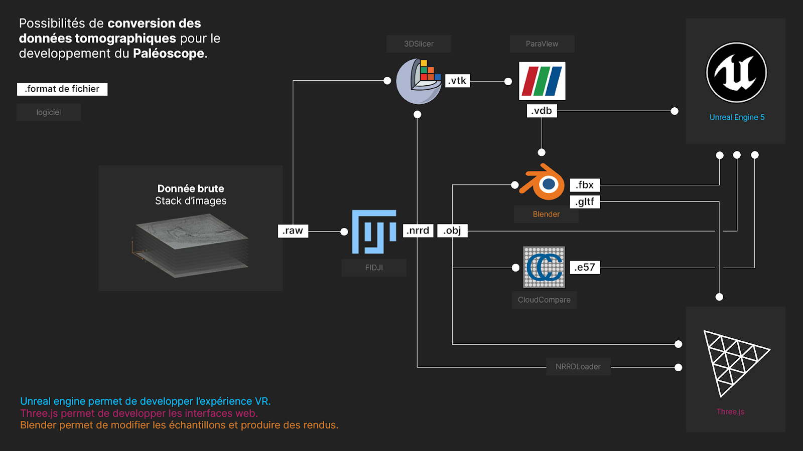
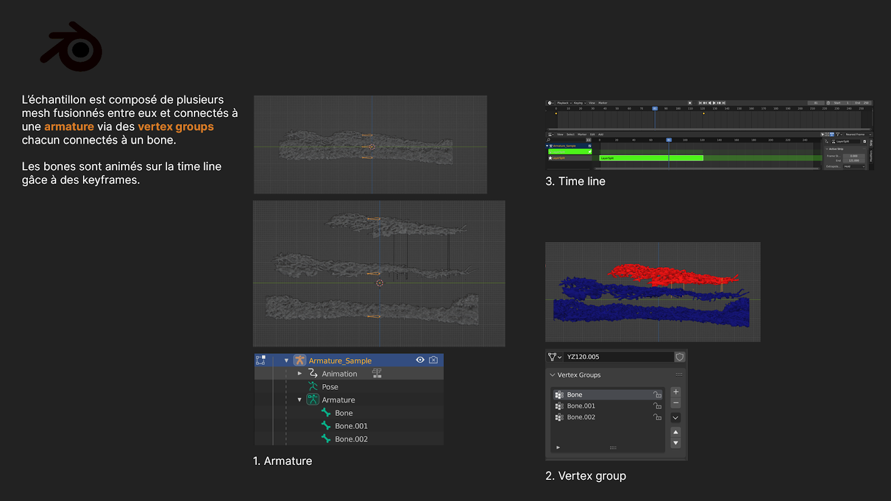
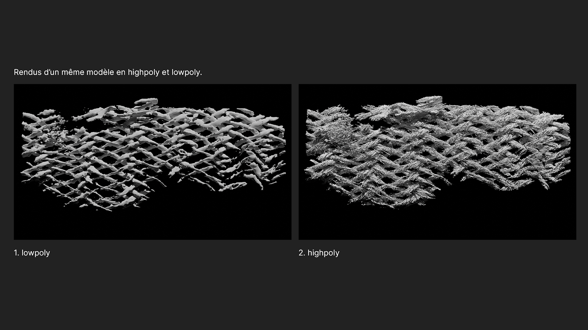
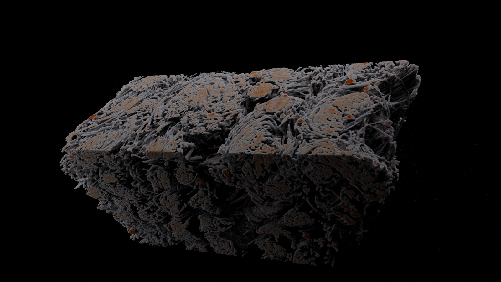
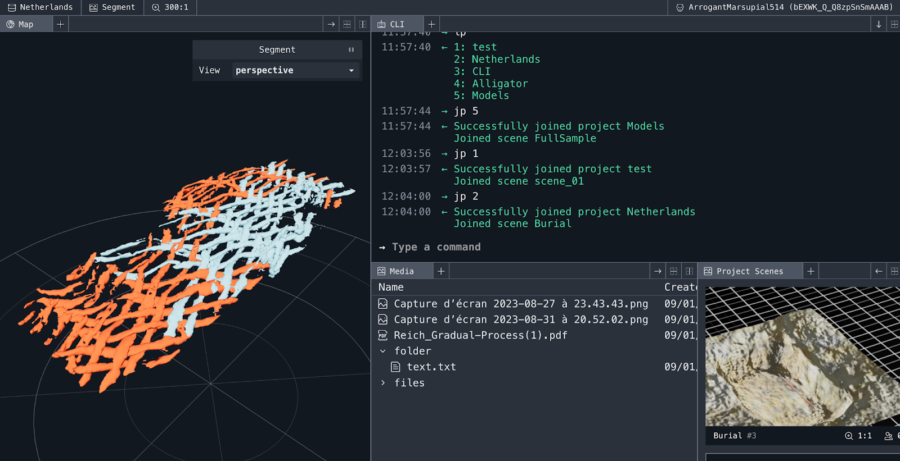
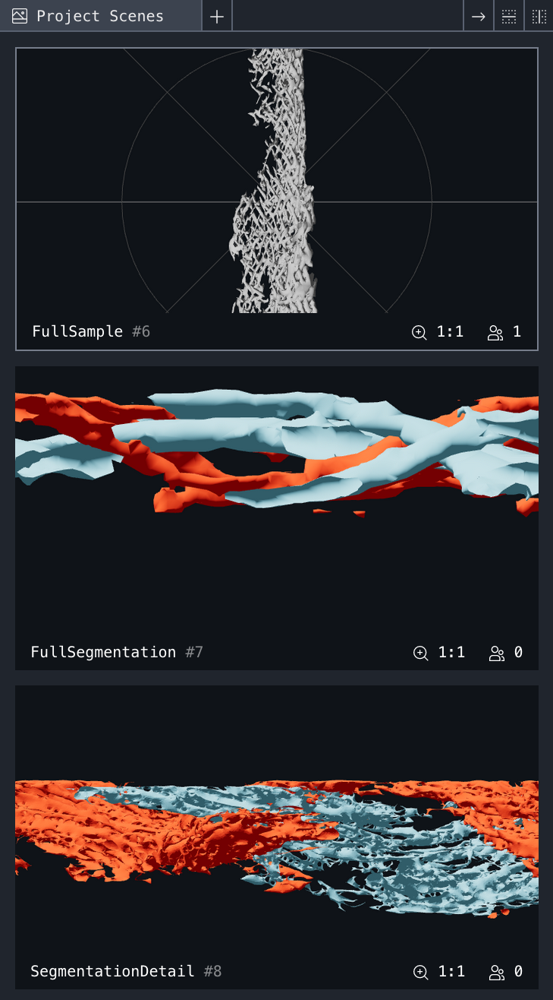
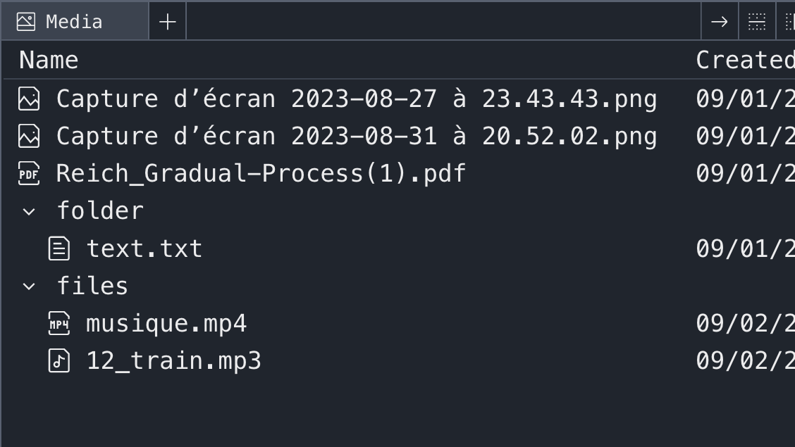

# Phase 2

MSH Paris-Saclay

**Contexte**

Ce document constitue le livrable de la deuxième phase du projet ImmArch3D mené avec Loïc Bertrand, Vincent Créance et James Auger et financé par la MSH Paris-Saclay sur l'exploration des matériaux du patrimoine avec une approche immersive.

**Objectifs de la phase**

Après une première phase d’une semaine de définition des scénarios d'usage du Paléoscope et de la suite d’outils à intégrer et d’exploration des possibilités de visualisation et de navigation dans les données tomographiques de vrais échantillons, la seconde phase du projet avait pour objectif de développer un prototype fonctionnel. L’objectif fixé était de créer un outil de médiation et de communication adressé à la fois aux chercheurs et au grand public, basé sur une expérience de manipulation des données 3D via un environnement web et en réalité virtuelle. L’enjeu étant de parvenir à réunir les utilisateurs web et VR dans un même projet, et ainsi interroger les façons de créer de l'interaction et de la complémentarité entre les utilisateurs VR et web.

Cette phase s’est déroulée sur deux semaines.

## A. Projet

Un projet est un espace sur lequel sont regroupées des scènes parmi lesquelles peuvent se déplacer des utilisateurs. Des médias peuvent également y être liés, accessibles depuis n’importe quelle scène du projet (documents, images, vidéos…).

### A.1 créer un nouveau projet sur le serveur

La première étape pour démarrer un projet est de le créer dans la base de données du Paléoscope via l'interface web. Pour l'instant cela se fait depuis le panneau CLI (ligne de commande, plus de détails en C.2.6) :

ouvrir un nouvel onglet ligne de commande

taper la commande`createproject NomDuProjet`

### A.2 Nouveau projet Unreal Engine

Pour créer un nouveau projet sur Unreal Engine 5 il faut télécharger le logiciel sur la plateforme Epic Games Launcher. Le Paléoscope est construit sur la version 5.2 du logiciel. Le projet est construit sur la base VR template qui offre une configuration de base et des préréglages optimisés pour la VR. Le projet est organisé en sous-dossiers (levels, materials, meshs, sequences, VFX, widgets etc.).

Les BluePrints (BP) sont un composant essentiel du développement sur Unreal Engine :  
« The Blueprint Visual Scripting system in Unreal Engine is a complete gameplay scripting system based on the concept of using a node-based interface to create gameplay elements from within Unreal Editor. As with many common scripting languages, it is used to define object-oriented (OO) classes or objects in the engine. » – Documentation Unreal Engine

Le projet est scindé en deux catégories d’acteurs : les acteurs indépendants et propres à l’environnement Unreal (le décor, les matériaux…) et les acteurs reliés au serveur (les échantillons, les beacons, VRPawn, écrans) qui lui transmettent et/ou reçoivent des informations sur les scènes.

La connexion au serveur se fait par l’intermédiaire du BluePrint BP\_GameInstance qui agit à l'échelle du projet et qui conserve donc les informations lors des changements de scène (level).

  
Organisation du projet

  
Websockets (détails du blueprint)

## B. Scène

Une scène se compose d’un modèle 3D qui peut contenir des animations, des balises, et peut être rejoint par des utilisateurs.

### B.1 Création du modèle 3D

Le Paléoscope permet de naviguer dans des échantillons réels. Ces échantillons sont obtenus grâce à la tomographie. Afin d’intégrer un échantillon dans un environnement 3D il faut effectuer une suite d’opérations consistant à changer le format et le poids du fichier. Les stacks d’images en .raw ne sont pas lisibles par les logiciels de 3D, et les fichiers sont souvent beaucoup trop lourds pour être manipulés tels quel. Le poids de l’échantillon et son format d’export diffère selon qu’il est destiné au web ou à la VR. A partir du fichier raw il est aussi possible de créer des rendus photoréalistes de l’échantillon.

#### B.1.1 Tomographie

La tomographie permet sans contact et sans destruction, de visualiser l’intérieur de la matière, par exemple les différentes couches d’un textile minéralisé. Cette technique d’imagerie utilisée en sciences et mécanique des matériaux permet d’analyser la microstructure des matériaux sans être intrusif et/ou destructif. La tomographie fournit une image tridimensionnelle à partir d’une série de radiographies via un calcul appelé la reconstruction.

#### B.1.2 Les exports

Le logiciel Unreal Engine 5, que l’on utilise pour développer la partie VR de l’écosystème, est capable de lire un nombre assez restreint de fichiers : mesh (OBJ ou FBX), voxel (VDB) ou nuage de points (E57). Nous favorisons les exports en format FBX car ils permettent d'exporter les textures et les animations rattachés à un échantillon. Pour intégrer des modèles 3D dans l’interface web il faut exporter des fichiers au format GLTF (.glb), cela nécessite de passer impérativement par un logiciel de 3D tel que Blender. Comme le FBX le fichier GLTF contient les textures et les animations du modèle.

  
Schéma de conversion des données

Introduire toutes ces étapes de conversion dans le Paléoscope pourrait être une piste de développement.

#### B.1.3 Animations

Nous avons la possibilité d’associer des animations à nos modèles 3D, pour par exemple séparer les éléments d’un échantillon et le visualiser en éclaté (en VR et sur le web). La création d’une animation doit passer par un logiciel de 3D tel que Blender.

Il y a deux façons de créer une animation : 

1.  Associer un objet 3D (qui peut contenir plusieurs meshs) à une armature par l'intermédiaire de vertex groups et animer cette armature au moyen de keyframes.

2.  Animer plusieurs objets 3D séparés avec des keyframes.

Nous avons testé les deux techniques, la solution 1 avec l’armature est la plus adaptée car elle permet d’exporter une animation à la fois utilisable sur le web (GLTF/GLB) et sur Unreal Engine (FBX). Les utilisateurs verront alors exactement la même animation, que ce soit sur le web ou en VR.

#### B.1.4 Low-poly ou high-poly ?

Un objet 3D est composé de vertices (anglais pour sommets), des points ayant des coordonnées 3D (x, y, z) qui forment des segments et des surfaces. A partir du moment où l’on convertit les données du format .raw ou .vdb en mesh, le volume 3D est alors composé de vertices.  Le nombre de vertices va conditionner le poids du fichier. Pour optimiser les performances il est recommandé de réduire le nombre de vertices, pour avoir un modèle détaillé il faut l’augmenter :

1.  Le web supporte moins bien les gros fichiers, il faut donc limiter les modèles à environ 100 000 vertices.

1.  Unreal Engine 5, grâce au système d’optimisation Nanite, est capable de lire de très gros fichiers (dizaines de millions de vertices). Cependant il est recommandé de garder ce nombre relativement bas pour s’assurer des performances correctes en réalité virtuelle ( + ou - 1 million max).

Pour contrôler le nombre de polygone d’un objet 3D nous avons plusieurs possibilités : 

1.  la retopologie, cela consiste à venir modéliser un nouveau mesh par dessus le mesh high-poly en veillant à optimiser au maximum la géométrie. C’est un processus long et technique qui n’est pas adapté à des échantillons chaotiques.

1.  la décimation des vertices d’un mesh, on applique un modifier (blender) qui va supprimer un pourcentage défini des vertices de l’objet. C’est efficace mais pas très précis.

2.  la voxelisation, on voxelise le mesh de base grâce à un modifier (blender), c’est le procédé le plus efficace. 

En combinant ces différentes méthodes on peut obtenir de très bon résultats.

#### B.1.5 Matériaux 

Pour appliquer un matériau spécifique à un objet on peut soit utiliser un map UV soit se baser sur des paramètres plus ou moins hasardeux relatifs à l’objet.  
La création d’une map UV via le procédé d’*UV unwrapping* est adaptée aux modèles simples mais peut s’avérer dure, voire impossible pour des modèles très complexes tels que les échantillons tomographiques.  
Les systèmes de matériaux diffèrent selon les logiciels utilisés, l’utilisation d’un map UV et de textures bakées assure une bonne continuité sur les différents logiciels. Cette étape doit être réalisée sur Blender. Les modèles 3D ne pouvant pas être unwrappés doivent se voir appliquer au minimum un matériau avec une couleur et un smooth ou flat shading.

Une fois prêt, le fichier peut être exporté en .fbx pour Unreal Engine 5 et en .glb (GLTF) pour le web.

#### B.1.6 Rendus 3D

En important des fichiers VDB dans Blender on peut conserver les niveaux de gris de chaque voxel ainsi que des données colorées produites sur ParaView. On peut alors récupérer ces informations stockées sous forme d’attributs dans le fichier vdb, et les utiliser pour créer des textures.

En travaillant directement avec le fichier VDB on peut produire des images avec un niveau de détail plus important et moins gourmand en ressource qu’en utilisant des *meshs*.

Ces rendus (photoréalistes ou non), peuvent servir de documents support à l’expérience VR/Web en fournissant des images avec un niveau de détail impossible à obtenir en temps réel.

### B.2 Intégration au serveur

Une fois le modèle 3D exporté en format GLB, il faut le placer dans le code source du serveur (c'est une solution provisoire qui simplifie l'architecture technique du projet en stockant ces fichiers côté client, l'idée à l'avenir serait de pouvoir importer le modèle directement depuis l'interface web).

1.  dans le code source de paleoscope-v2-webclient créer un dossier dans /public/scenes et lui donner un nom (par exemple « nouvellescene »)

1.  renommer le fichier 3D « model.glb » et le placer dans le dossier nouvellement créé

2.  ajouter une image « thumbnail.png » dans ce même dossier qui représente l'échantillon

On peut ensuite créer la scène dans la base de données du Paléoscope via l'interface web. Pour l'instant cela se fait depuis le panneau CLI (ligne de commande) :

1.  ouvrir un nouvel onglet ligne de commande

2.  taper la commande`createscene NomDeLaScene nomdudossier largeur hauteur profondeur zoom` où`nomdudossier` est le nom défini dans l'étape 1,`largeur`,`hauteur` et`profondeur` sont les dimensions de la scène en centimètres (dimensions dans la VR, pas dans la réalité) et`zoom` est le grossissement de l'échantillon (300 pour une échelle 300:1)

Si tout s'est correctement passé, l'échantillon est maintenant créé et doit être visible dans le panneau de navigation dans les scènes.

### B.3 Intégration dans Unreal

Une fois le modèle exporté au format FBX il faut l’importer sur Unreal Engine 5. Si le modèle comporte des animations il faut l’importer en tant que skeletal mesh, sinon sous forme de static mesh.

1.  Importer le nouveau modèle dans le dossier mesh

1.  Dans le dossier level créer un nouveau level au nom de l’échantillon (ou dupliquer un ancien level pour conserver les paramètres de base).

2.  Créer un nouveau blueprint et glisser le mesh de l’échantillon (static ou skeletal) dans ce BP. On pourrait glisser directement le mesh dans la scène mais la création d’un blueprint permet plus de souplesse si l’on veut interagir avec l’échantillon, par exemple ajouter des animations etc…

3.  Attention, il ne faut pas toucher à l'échelle de l’échantillon. En effet, pour synchroniser parfaitement la VR et le web les modèles doivent être à la même échelle des deux côtés..

4.  En lançant la prévisualisation VR on peut maintenant naviguer dans et autour de l’échantillon.

## C. Utilisation et outils

Le Paléoscope permet plusieurs types d’interactions au sein de la VR et sur l’interface web. Certaines sont propres à la VR, telles que la navigation et le dessin, d’autres au web, tel que l’affichage de médias, le contrôle des scènes etc… d’autres encore sont communes au deux espaces, tel que la création de balise. Ces outils ont pour but de créer un rapport de complémentarité entre le(s) utilisateur(s) VR et Web, car  chacun perçoit l'échantillon différemment.

### C.1 Dans la VR

La perception de l’expérience en réalité virtuelle est très physique. Les sens sont trompés par la vision stéréoscopique, le son spatialisé et les retours haptiques transmis par le casque de VR. Nous avons tenté d’utiliser au mieux ces différentes façons d’affecter la perception de l’utilisateur VR, cependant beaucoup pourrait être encore fait. 

Une partie des fonctionnalités sont liées directement sur les touches des contrôleurs, telle que la navigation, l’affichage du menu et le déclenchement de certaines interactions avec les gâchettes. Le reste des fonctionnalités est accessible depuis le menu de la main gauche (x). Nous avons fait ce choix par souci de simplicité afin de ne pas perdre les utilisateurs dans un flot de touches compliquées à retenir.

#### C.1.1 Navigation

Il existe deux façons de se déplacer dans les scènes VR : 

1.  L’utilisation du joystick du contrôleur gauche permet de se déplacer d’avant en arrière et de droite à gauche par rapport à l’orientation du casque de VR.

1.  En pressant la gâchette de la manette gauche on peut sélectionner un point à distance, en relâchant la gâchette on peut s’y téléporter. La téléportation demande plus de préparation de la scène au préalable, il faut en effet paramétrer un NavMeshVolume pour définir la zone de navigation.

  
Blueprints

#### C.1.2 Balises

Les balises sont l'une des composantes essentielles du Paléoscope, elles ont pour fonction de marquer des zones d’intérêt et de pouvoir y associer du contenu (médias). Leur position est stockée sur le serveur. Elles sont visibles et modifiables aussi bien depuis la VR que le web. 

1.  Pour créer une balise en VR il faut accéder au menu de la main gauche > Beacon > new Beacon. Une animation se déclenche, faisant apparaître une petite balise dans la main droite de l'utilisateur. Il suffit alors de presser la gâchette du contrôleur droit pour créer une nouvelle balise.

1.  Pour supprimer une balise l’utilisateur VR doit s’approcher de la balise et depuis le menu de la main gauche > Beacon > delete Beacon

2.  Pour supprimer toutes les balises, depuis le menu de la main gauche > Beacon > clear Beacons

  
Blueprints

#### C.1.3 Dessin

La fonctionnalité dessin, ou sketch, est propre à la VR. Elle permet aux utilisateurs VR de dessiner dans l’espace en 3 dimensions. L’utilisateur à le choix entre plusieurs couleurs et peut faire varier le diamètre de son pinceau.

1.  Pour dessiner, accéder au menu de la main gauche > sketch. Une animation se déclenche faisant apparaître une sphère blanche dans la main droite.

1.  Pour dessiner, presser la gâchette droite et déplacer sa main dans l’espace(retour haptique), le trait s'interrompt lorsque l’on relâche la gâchette. 

2.  Pour faire varier le diamètre de la sphère (qui correspond au pinceau), déplacer la glissière du menu sketch de droite à gauche (suivi d’un retour haptique suivant la taille).

3.  Pour changer de couleur, cliquer sur les cases colorées, la couleur de la sphère changera en fonction..

4.  Pour effacer les dessins, menu main gauche> sketch> clear sketch

La fonctionnalité dessin repose sur le système de particule Niagara de Unreal Engine. Pour pouvoir créer plusieurs traits indépendants les uns des autres avec un seul système, nous jouons sur l’assignation des matériaux. Quand on dessine le matériau est visible, quand on ne dessine pas il est invisible mais le système tourne encore.  
- lorsque que l’on commence à dessiner (RightTriggerPressed) un nouveau système est créé  
- lorsque de l’on relâche la gâchette le système continue de tourner mais l’opacité du trait passe à zéro.  
- quand on presse à nouveau la gâchette, le trait gagne en opacité et redevient visible.  
- quand on appelle la fonction clear sketch le système Niagara est alors détruit.

#### C.1.4 Objets interactifs

Il est possible d'interagir avec plusieurs types d’objets dans la VR : 

1.  Les objets *grabbable*, qui peuvent être saisis et déplacés quand on rentre en collision avec et que l’on presse la touche *grab* du contrôleur (droit ou gauche). Ces objets peuvent être de toutes natures (morceaux de l’échantillon, objet…). La sensation de saisir un objet et de le déplacer en VR est très agréable et participe à une sensation d’immersion forte, cette fonctionnalité pourrait donc être élargit à d’autres domaines  
    

1.  Les éléments d’interface (widgets), par exemple le menu de la main gauche ou les glissières de contrôle d’animation. Les menus interactifs en VR sont des WidgetBluePrint parentés à un ActorBluePrint, cela permet de donner une matérialité au widget et de pouvoir être disposé dans l’espace 3D. Cet ActorBluePrint peu lui même être parenté à d’autre BluePrint pour par exemple créer un menu attaché à la main gauche du joueur.  
    

2.  Les écrans, qui sont des widgets mais connectés au web via un lien URL. Avec le pointeur du contrôleur droit on peut naviguer sur ces pages, cliquer (droit ou gauche) et accéder normalement à tout le site web  
    

### C.2 Sur l’interface web

L'interface à été conçue comme une espace modulaire dans lequel peuvent s'agencer plusieurs fenêtres de panneaux. Cela lui permet de s'adapter à n'importe quel cas d'usage (conférence, session de travail…).

En haut de l'écran se trouve une barre d'information concernant le projet et la scène en active (à gauche), et l'utilisateur (à droite). Le bouton casque de VR en haut à droite permet de passer en affichage VR, une interface plus grosse qui ne permet d'ouvrir qu'un panneau à la fois.

Chaque fenêtre peut contenir plusieurs panneaux cumulables sous forme d'onglets accessibles en un clic. Le bouton « + » permet d'en ajouter parmi une liste. Les boutons à droite servent à gérer la disposition des fenêtres dans l'espace de travail : déplacer la fenêtre avant ou après les autres et la diviser verticalement ou horizontalement.

En plaçant le curseur sur un onglet, il est possible de le fermer. Lorsque le dernier onglet est fermé, la fenêtre disparaît.

Il existe aujourd'hui 7 panneaux différents :

1.  Carte de l'échantillon

1.  Navigation parmi les scènes du projet

2.  Liste d'utilisateurs

3.  Liste des balises de la scène

4.  Navigateur de médias (images, PDF, vidéos…)

5.  Ligne de commande

6.  Logs du serveur

#### C.2.1 Carte

La carte permet de manière interactive d'observer l'échantillon en trois dimensions et de suivre la progression spatiale des utilisateurs VR présents dans la scène. On peut aussi y retrouver les balises et les éventuelles animations disponibles sur les échantillons.

#### C.2.2 Navigation parmi les scènes du projet

Le panneau de scènes est un menu très simple permettant de se déplacer d'une scène à l'autre. On peut y apercevoir des miniatures pour nous guider ainsi que l'échelle de l'échantillon et le nombre d'utilisateurs connectés.

#### C.2.3 Liste d'utilisateurs

La liste des utilisateurs affiche tous les utilisateurs connectés au projet. Les utilisateurs étant sur une autre scène sont grisés. Avec un clic droit, il est possible de les rejoindre. L'icône à côté du nom d'utilisateur indique si l'utilisateur est sur le web ou dans la VR.

#### C.2.4 Liste des balises de la scène

La liste des balises affiche toutes les balises créées dans la scène. Avec un clic droit, il est possible d’en supprimer. Pour en créer depuis l’interface web, cependant, il faut pour l’instant passer par la ligne de commande (C.2.6).

#### C.2.5 Navigateur de médias

Le navigateur de médias du projet permet de stocker et de lire des fichiers en ligne. Pour ajouter des fichiers il faut passer par la ligne de commande (C.2.6). Les formats supportés sont les suivants : texte brut, images, vidéos, audio et PDF.

#### C.2.6 Ligne de commande

La ligne de commande permet de réaliser des actions parfois plus rapidement qu'avec l'interface graphique, ou que l'interface graphique n'implémente pas encore. Les fonctions disponibles sont les suivantes :

| Commande                                                                                            | Description                            |
|-----------------------------------------------------------------------------------------------------|----------------------------------------|
| `createproject <name>`                                            | Créer un nouveau projet                |
| `listproject`                                                     | Lister tous les projets                |
| `joinproject <project id>`                                        | Rejoindre un projet                    |
| `removeproject <id>`                                              | Supprimer un projet (admin)            |
| `createscene <name> <model name> <width> <height> <depth> <zoom>` | Créer une nouvelle scène               |
| `listscenes`                                                      | Lister toutes les scènes               |
| `joinscene <scene id>`                                            | Rejoindre une scène                    |
| `removescene <id>`                                                | Supprimer une scène                    |
| `createbeacon <x> <y> <z> [name]`                                 | Créer une balise                       |
| `movebeacon <beacon id> <x> <y> <z>`                              | Déplacer une balise                    |
| `removebeacon <beacon id>`                                        | Supprimer une balise                   |
| `removeallbeacons`                                                | Supprimer toutes les balises           |
| `listmedias`                                                      | Lister tous les médias                 |
| `addmedia <path>`                                                 | Ajouter un média en ligne              |
| `updatemedia <id> <path>`                                         | Mettre à jour la source d’un média     |
| `removemedia <id>`                                                | Supprimer un média                     |
| `listusers`                                                       | Lister tous les utilisateurs du projet |
| `me`                                                              | Obtenir de l'information sur moi       |
| `nickname <new nickname>`                                         | Changer de pseudonyme                  |
| `clear`                                                           | Vider l’écran de la ligne de commande  |
| `help`                                                            | Afficher l’aide des commandes          |

Dans les commandes du tableau ci-dessus, les arguments entre `<chevrons>` sont obligatoires, ceux entre `[crochets]` sont facultatifs. Attention, l'ordre des arguments est important pour que l'interpréteur puisse les différencier.

#### C.2.7 Logs du projet

Les logs du projet sont parfois utiles pour pister un bug ou pour mieux comprendre une situation, mais il est rare d'en avoir besoin pendant une utilisation normale du Paléoscope.
