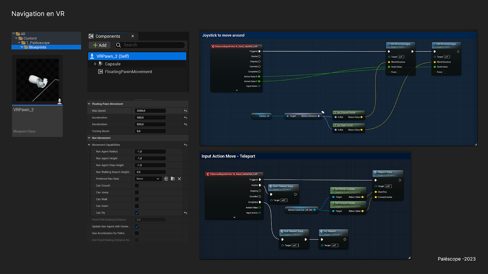
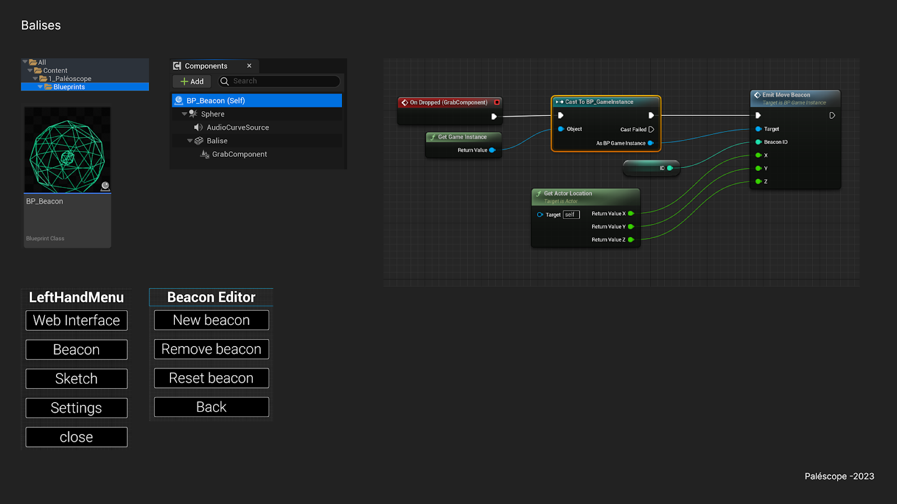
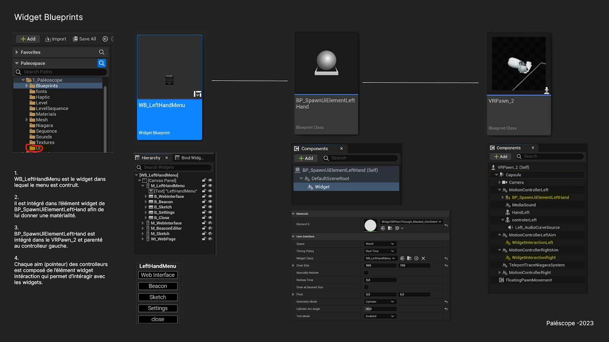
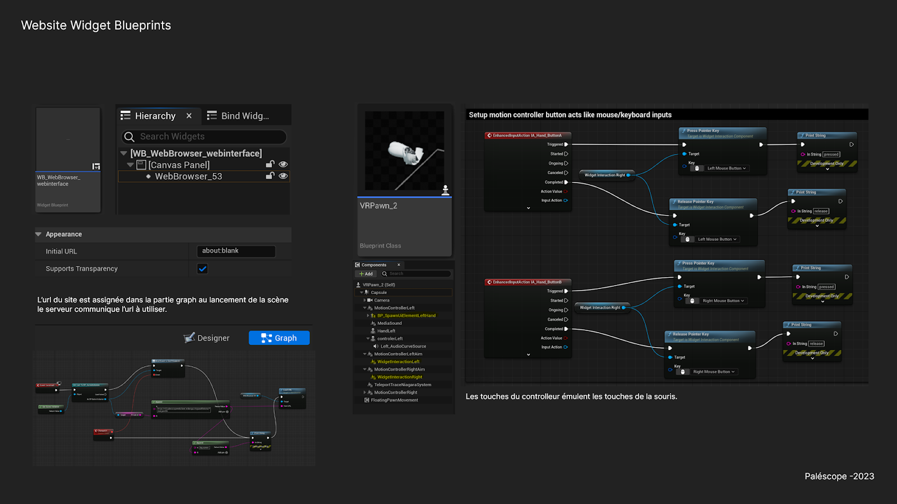
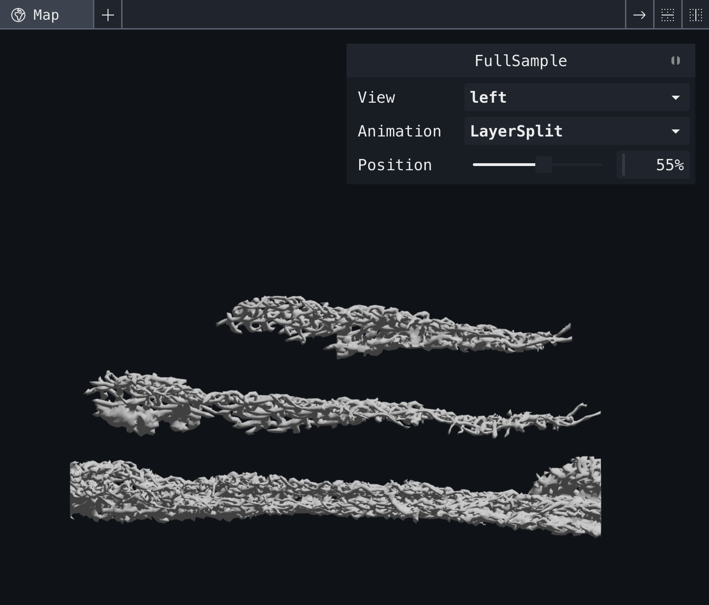
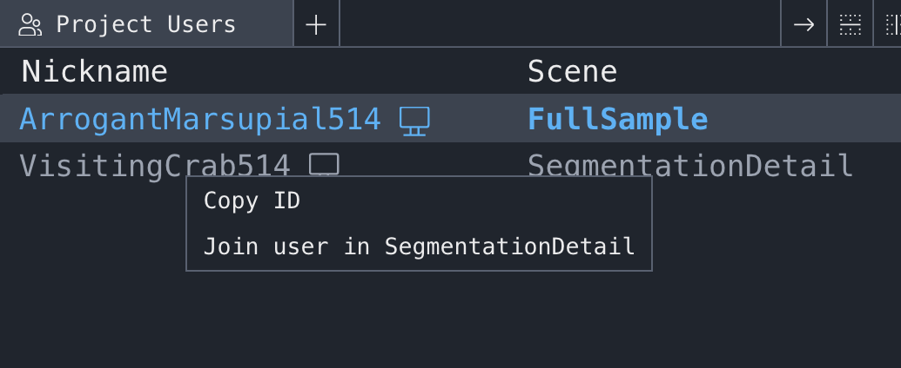
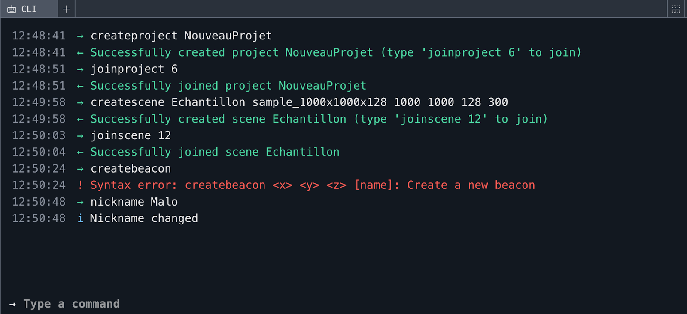
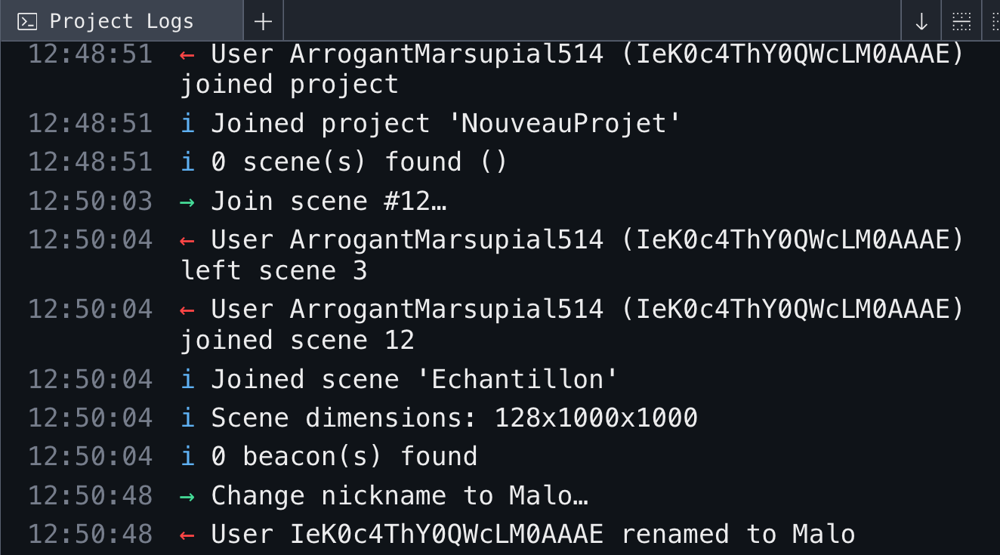

# Utilisation des outils du Paléoscope

Le Paléoscope permet plusieurs types d’interactions au sein de la VR et sur l’interface web. Certaines sont propres à la VR, telles que la navigation et le dessin, d’autres au web, tel que l’affichage de médias, le contrôle des scènes etc… d’autres encore sont communes au deux espaces, tel que la création de balise. Ces outils ont pour but de créer un rapport de complémentarité entre le(s) utilisateur(s) VR et Web, car  chacun perçoit l'échantillon différemment.

## 1. En réalité virtuelle

La perception de l’expérience en réalité virtuelle est très physique. Les sens sont trompés par la vision stéréoscopique, le son spatialisé et les retours haptiques transmis par le casque de VR. Nous avons tenté d’utiliser au mieux ces différentes façons d’affecter la perception de l’utilisateur VR, cependant beaucoup pourrait être encore fait. 

Une partie des fonctionnalités sont liées directement sur les touches des contrôleurs, telle que la navigation, l’affichage du menu et le déclenchement de certaines interactions avec les gâchettes. Le reste des fonctionnalités est accessible depuis le menu de la main gauche (x). Nous avons fait ce choix par souci de simplicité afin de ne pas perdre les utilisateurs dans un flot de touches compliquées à retenir.

### 1.1 Navigation

Il existe deux façons de se déplacer dans les scènes VR : 

1.  L’utilisation du joystick du contrôleur gauche permet de se déplacer d’avant en arrière et de droite à gauche par rapport à l’orientation du casque de VR.

1.  En pressant la gâchette de la manette gauche on peut sélectionner un point à distance, en relâchant la gâchette on peut s’y téléporter. La téléportation demande plus de préparation de la scène au préalable, il faut en effet paramétrer un NavMeshVolume pour définir la zone de navigation.

  
Blueprints

### 1.2 Balises

Les balises sont l'une des composantes essentielles du Paléoscope, elles ont pour fonction de marquer des zones d’intérêt et de pouvoir y associer du contenu (médias). Leur position est stockée sur le serveur. Elles sont visibles et modifiables aussi bien depuis la VR que le web. 

1.  Pour créer une balise en VR il faut accéder au menu de la main gauche > Beacon > new Beacon. Une animation se déclenche, faisant apparaître une petite balise dans la main droite de l'utilisateur. Il suffit alors de presser la gâchette du contrôleur droit pour créer une nouvelle balise.

1.  Pour supprimer une balise l’utilisateur VR doit s’approcher de la balise et depuis le menu de la main gauche > Beacon > delete Beacon

2.  Pour supprimer toutes les balises, depuis le menu de la main gauche > Beacon > clear Beacons

  
Blueprints

### 1.3 Dessin

La fonctionnalité dessin, ou sketch, est propre à la VR. Elle permet aux utilisateurs VR de dessiner dans l’espace en 3 dimensions. L’utilisateur à le choix entre plusieurs couleurs et peut faire varier le diamètre de son pinceau.

1.  Pour dessiner, accéder au menu de la main gauche > sketch. Une animation se déclenche faisant apparaître une sphère blanche dans la main droite.

1.  Pour dessiner, presser la gâchette droite et déplacer sa main dans l’espace(retour haptique), le trait s'interrompt lorsque l’on relâche la gâchette. 

2.  Pour faire varier le diamètre de la sphère (qui correspond au pinceau), déplacer la glissière du menu sketch de droite à gauche (suivi d’un retour haptique suivant la taille).

3.  Pour changer de couleur, cliquer sur les cases colorées, la couleur de la sphère changera en fonction..

4.  Pour effacer les dessins, menu main gauche> sketch> clear sketch

La fonctionnalité dessin repose sur le système de particule Niagara de Unreal Engine. Pour pouvoir créer plusieurs traits indépendants les uns des autres avec un seul système, nous jouons sur l’assignation des matériaux. Quand on dessine le matériau est visible, quand on ne dessine pas il est invisible mais le système tourne encore.  
- lorsque que l’on commence à dessiner (RightTriggerPressed) un nouveau système est créé  
- lorsque de l’on relâche la gâchette le système continue de tourner mais l’opacité du trait passe à zéro.  
- quand on presse à nouveau la gâchette, le trait gagne en opacité et redevient visible.  
- quand on appelle la fonction clear sketch le système Niagara est alors détruit.

### 1.4 Objets interactifs

Il est possible d'interagir avec plusieurs types d’objets dans la VR : 

1.  Les objets *grabbable*, qui peuvent être saisis et déplacés quand on rentre en collision avec et que l’on presse la touche *grab* du contrôleur (droit ou gauche). Ces objets peuvent être de toutes natures (morceaux de l’échantillon, objet…). La sensation de saisir un objet et de le déplacer en VR est très agréable et participe à une sensation d’immersion forte, cette fonctionnalité pourrait donc être élargit à d’autres domaines  
    

1.  Les éléments d’interface (widgets), par exemple le menu de la main gauche ou les glissières de contrôle d’animation. Les menus interactifs en VR sont des WidgetBluePrint parentés à un ActorBluePrint, cela permet de donner une matérialité au widget et de pouvoir être disposé dans l’espace 3D. Cet ActorBluePrint peu lui même être parenté à d’autre BluePrint pour par exemple créer un menu attaché à la main gauche du joueur.  
    

2.  Les écrans, qui sont des widgets mais connectés au web via un lien URL. Avec le pointeur du contrôleur droit on peut naviguer sur ces pages, cliquer (droit ou gauche) et accéder normalement à tout le site web  
    

## 2. Sur l’interface web

L'interface à été conçue comme une espace modulaire dans lequel peuvent s'agencer plusieurs fenêtres de panneaux. Cela lui permet de s'adapter à n'importe quel cas d'usage (conférence, session de travail…).

En haut de l'écran se trouve une barre d'information concernant le projet et la scène en active (à gauche), et l'utilisateur (à droite). Le bouton casque de VR en haut à droite permet de passer en affichage VR, une interface plus grosse qui ne permet d'ouvrir qu'un panneau à la fois.

Chaque fenêtre peut contenir plusieurs panneaux cumulables sous forme d'onglets accessibles en un clic. Le bouton « + » permet d'en ajouter parmi une liste. Les boutons à droite servent à gérer la disposition des fenêtres dans l'espace de travail : déplacer la fenêtre avant ou après les autres et la diviser verticalement ou horizontalement.

En plaçant le curseur sur un onglet, il est possible de le fermer. Lorsque le dernier onglet est fermé, la fenêtre disparaît.

Il existe aujourd'hui 7 panneaux différents :

1.  Carte de l'échantillon

1.  Navigation parmi les scènes du projet

2.  Liste d'utilisateurs

3.  Liste des balises de la scène

4.  Navigateur de médias (images, PDF, vidéos…)

5.  Ligne de commande

6.  Logs du serveur

### 2.1 Carte

La carte permet de manière interactive d'observer l'échantillon en trois dimensions et de suivre la progression spatiale des utilisateurs VR présents dans la scène. On peut aussi y retrouver les balises et les éventuelles animations disponibles sur les échantillons.

### 2.2 Navigation parmi les scènes du projet

Le panneau de scènes est un menu très simple permettant de se déplacer d'une scène à l'autre. On peut y apercevoir des miniatures pour nous guider ainsi que l'échelle de l'échantillon et le nombre d'utilisateurs connectés.

### 2.3 Liste d'utilisateurs

La liste des utilisateurs affiche tous les utilisateurs connectés au projet. Les utilisateurs étant sur une autre scène sont grisés. Avec un clic droit, il est possible de les rejoindre. L'icône à côté du nom d'utilisateur indique si l'utilisateur est sur le web ou dans la VR.

### 2.4 Liste des balises de la scène

La liste des balises affiche toutes les balises créées dans la scène. Avec un clic droit, il est possible d’en supprimer. Pour en créer depuis l’interface web, cependant, il faut pour l’instant passer par la ligne de commande (2.6).

### 2.5 Navigateur de médias

Le navigateur de médias du projet permet de stocker et de lire des fichiers en ligne. Pour ajouter des fichiers il faut passer par la ligne de commande (2.6). Les formats supportés sont les suivants : texte brut, images, vidéos, audio et PDF.

### 2.6 Ligne de commande

La ligne de commande permet de réaliser des actions parfois plus rapidement qu'avec l'interface graphique, ou que l'interface graphique n'implémente pas encore. Les fonctions disponibles sont les suivantes :

| Commande                                                                                            | Description                            |
|-----------------------------------------------------------------------------------------------------|----------------------------------------|
| `createproject <name>`                                            | Créer un nouveau projet                |
| `listproject`                                                     | Lister tous les projets                |
| `joinproject <project id>`                                        | Rejoindre un projet                    |
| `removeproject <id>`                                              | Supprimer un projet (admin)            |
| `createscene <name> <model name> <width> <height> <depth> <zoom>` | Créer une nouvelle scène               |
| `listscenes`                                                      | Lister toutes les scènes               |
| `joinscene <scene id>`                                            | Rejoindre une scène                    |
| `removescene <id>`                                                | Supprimer une scène                    |
| `createbeacon <x> <y> <z> [name]`                                 | Créer une balise                       |
| `movebeacon <beacon id> <x> <y> <z>`                              | Déplacer une balise                    |
| `removebeacon <beacon id>`                                        | Supprimer une balise                   |
| `removeallbeacons`                                                | Supprimer toutes les balises           |
| `listmedias`                                                      | Lister tous les médias                 |
| `addmedia <path>`                                                 | Ajouter un média en ligne              |
| `updatemedia <id> <path>`                                         | Mettre à jour la source d’un média     |
| `removemedia <id>`                                                | Supprimer un média                     |
| `listusers`                                                       | Lister tous les utilisateurs du projet |
| `me`                                                              | Obtenir de l'information sur moi       |
| `nickname <new nickname>`                                         | Changer de pseudonyme                  |
| `clear`                                                           | Vider l’écran de la ligne de commande  |
| `help`                                                            | Afficher l’aide des commandes          |

Dans les commandes du tableau ci-dessus, les arguments entre `<chevrons>` sont obligatoires, ceux entre `[crochets]` sont facultatifs. Attention, l'ordre des arguments est important pour que l'interpréteur puisse les différencier.

### 2.7 Logs du projet

Les logs du projet sont parfois utiles pour pister un bug ou pour mieux comprendre une situation, mais il est rare d'en avoir besoin pendant une utilisation normale du Paléoscope.
